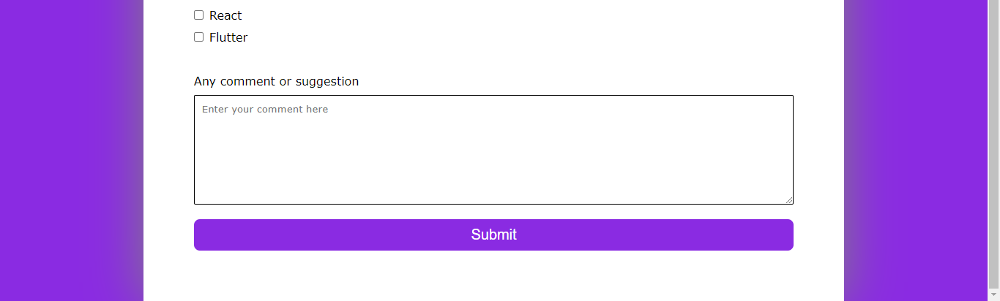
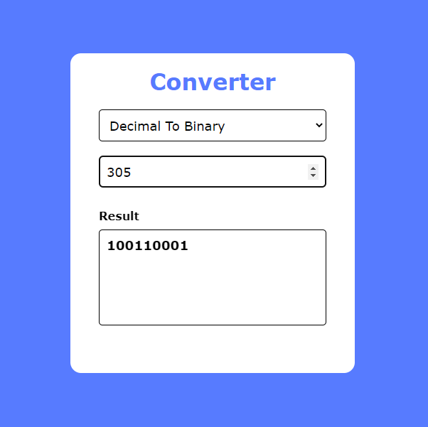
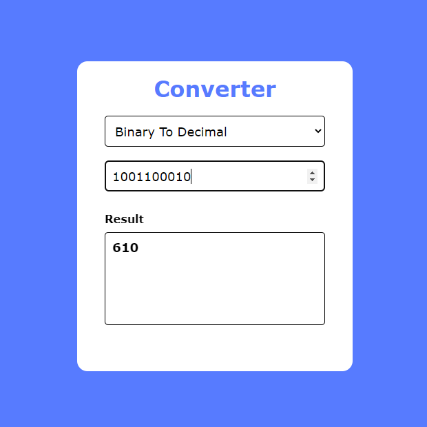
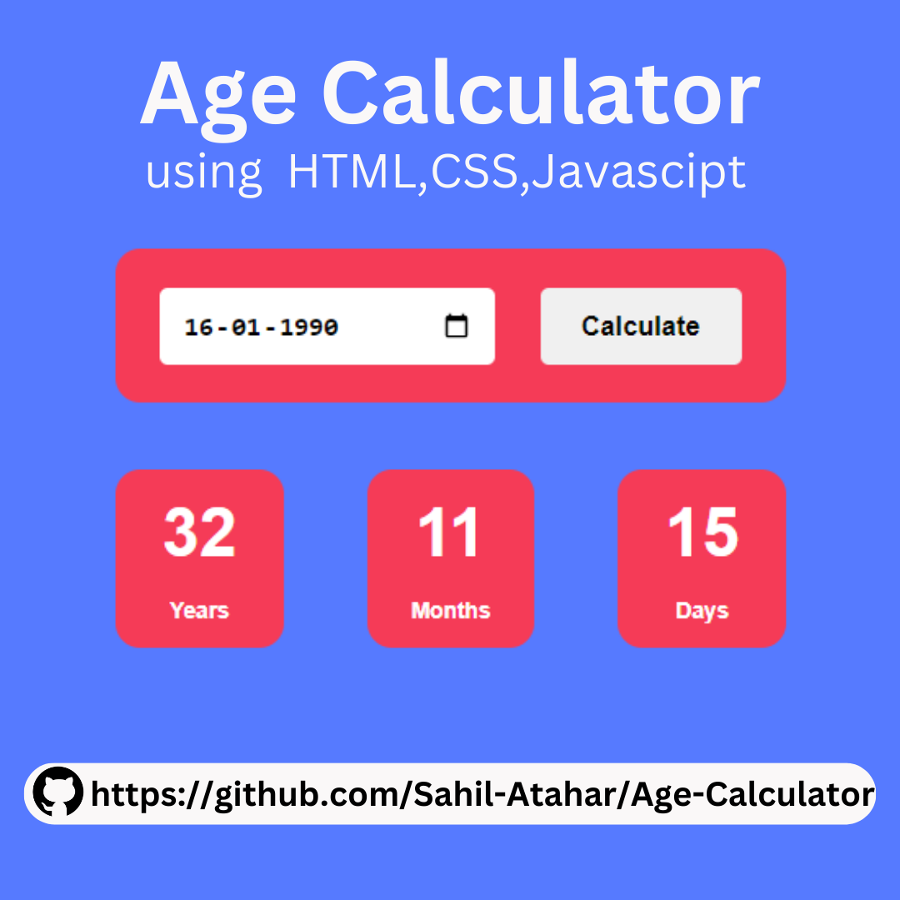
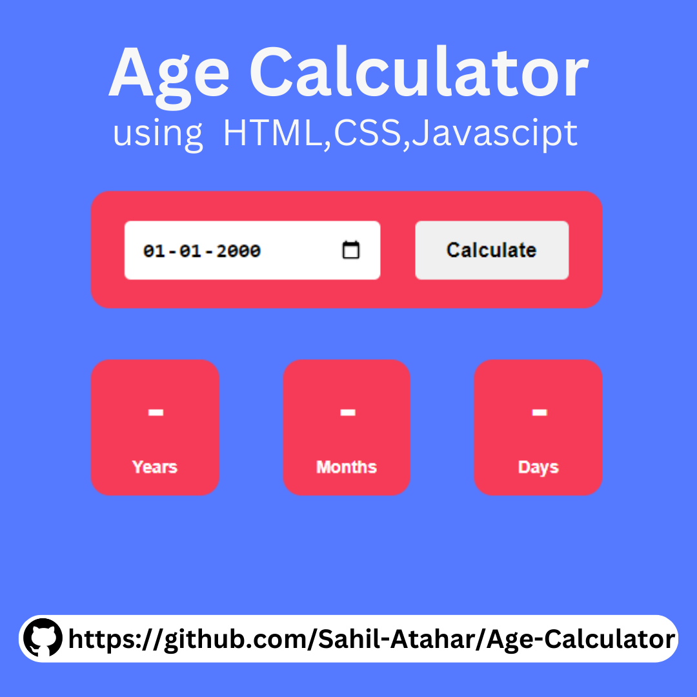

# HTML-CSS-JavaScript

This is my project created using HTML , CSS , JavaScript

# :camera: Screenshot

## (1) Survey Form

## (2) Decimal To Binary Converter

## (3) Age Calculator

## (4) Internet Connection Checker

https://user-images.githubusercontent.com/100127570/211485127-8c36fe70-6ac7-44a3-a5ac-380304008984.mp4

