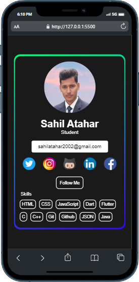
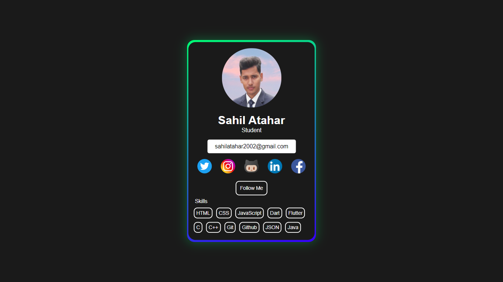
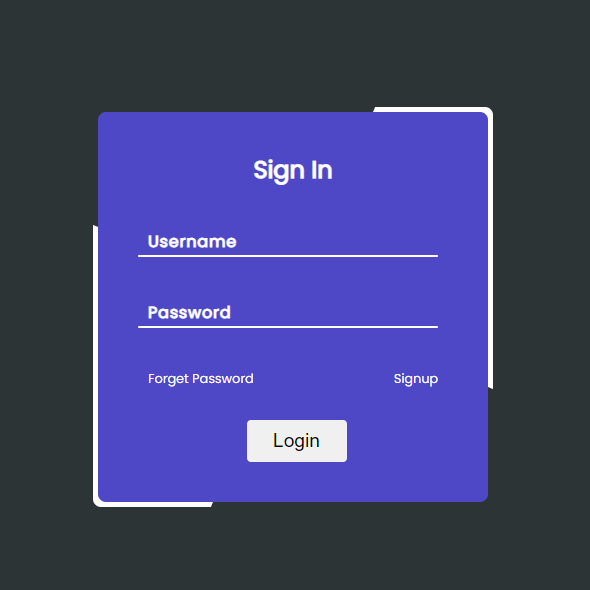
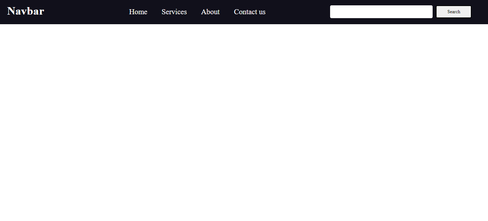
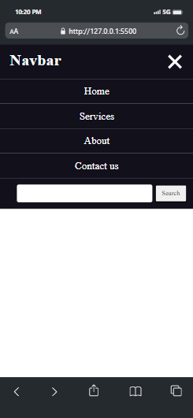
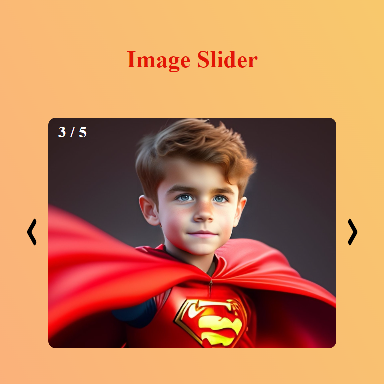
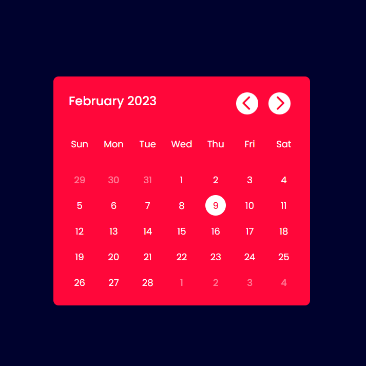
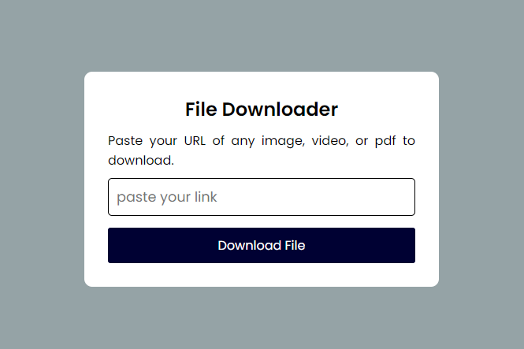
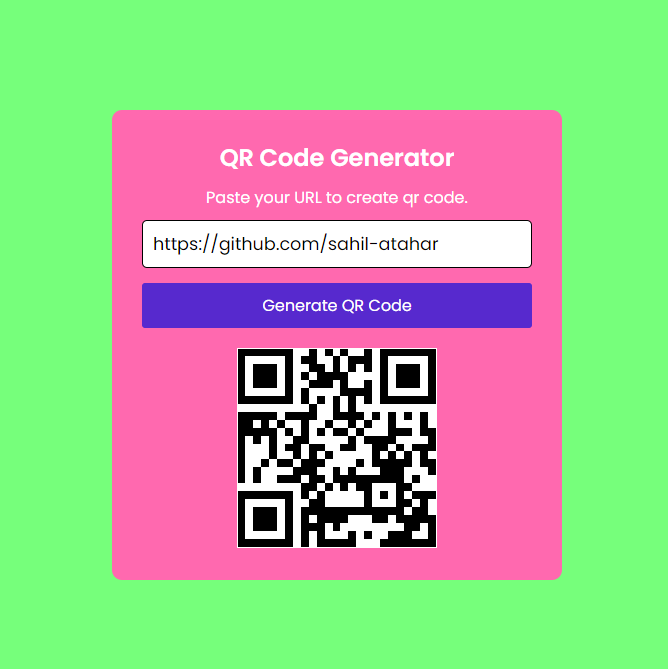

# HTML-CSS-JavaScript

These are simple project created using HTML, CSS, vanilla JavaScript

# :camera: Screenshot

## (1) Survey Form

## (2) Decimal To Binary Converter

## (3) Age Calculator

## (4) Internet Connection Checker

https://user-images.githubusercontent.com/100127570/211485127-8c36fe70-6ac7-44a3-a5ac-380304008984.mp4

## (5) Profile Card

https://user-images.githubusercontent.com/100127570/212472997-bb4fb495-b06a-475b-839d-f01c39729864.mp4

## (6) Sign in Page

https://user-images.githubusercontent.com/100127570/212527202-e8abb92b-f6bb-4539-a49b-e51459af8a60.mp4

## (7) Responsive Navbar

<table>
<tr>
    <td>
        
    </td>
    <td>
        
    </td>
</tr>
</table>

## (8) Image Slider

https://user-images.githubusercontent.com/100127570/213699818-4d866fb8-73c0-4840-a83c-3ebd67db4120.mp4

## (9) Quetes Genrator

## (10) Snack Game

https://user-images.githubusercontent.com/100127570/216635285-ef5b68ab-8b69-453a-b1c5-1aa264c85e8a.mp4

## (11) CSS Animation

https://user-images.githubusercontent.com/100127570/217461633-e53daa23-d991-4649-9388-8ba7ed9f3f2b.mp4

## (12) Calender

## (13) File Downloader

## (14) QR Code Generator

## (15) Icon Hover Animation 

https://user-images.githubusercontent.com/100127570/218003097-676da603-5881-407f-9dc8-8802e5ee924d.mp4

